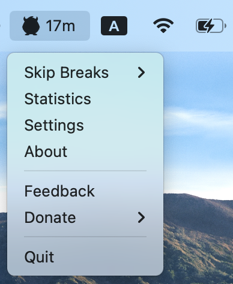

<p align="center">
  
</p>

# [BlinkBlink](https://blinkblinkapp.github.io/)

> **Healthy Eyes, Happy Life**

**BlinkBlink** is a lightweight, cross-platform desktop application designed to help you maintain eye health and productivity by preventing digital eye strain. It implements the **20-20-20 rule**: every 20 minutes, take a 20-second break and focus on something 20 feet away.



## ✨ Features

*   **20-20-20 Rule Enforcement**: Automatically reminds you to take breaks with a non-intrusive notification or a strict full-screen overlay.
*   **Fully Customizable**: Configure work duration, break duration, and notification sounds to fit your workflow.
*   **Smart Schedule**: Set your daily working hours so BlinkBlink only alerts you when you're actually working.
*   **Strict Mode**: Optional full-screen "Force Break" overlay that ensures you actually step away from the screen.
*   **Stats Tracking**: Keep track of your break streaks and daily progress.
*   **Cross-Platform**: Runs smoothly on **Windows**, **macOS**, and **Linux**.
*   **System Tray Integration**: Stays out of your way until you need it.

## 🚀 Installation

Download the latest version for your operating system from the [Releases Page](https://github.com/frozen0601/BlinkBlink-Releases/releases).

*   **Windows**: Download the `.exe` installer.
*   **macOS**: Download the `.dmg` file.
*   **Linux**: Download the `.snap` or `.AppImage` file.

## 🛠️ Development

To build BlinkBlink from source, ensure you have [Node.js](https://nodejs.org/) installed.

1.  **Clone the repository**
    ```bash
    git clone https://github.com/your-username/BlinkBlink-SourceCode.git
    cd BlinkBlink-SourceCode
    ```

2.  **Install dependencies**
    ```bash
    npm install
    ```

3.  **Run in development mode**
    ```bash
    npm start
    ```

4.  **Build for production**
    ```bash
    # Build for your current OS
    npm run dist

    # Build specifically for Linux
    npm run dist:linux
    ```

## 🏗️ Tech Stack

*   **[Electron](https://www.electronjs.org/)**: Framework for building cross-platform desktop apps.
*   **[TypeScript](https://www.typescriptlang.org/)**: For type-safe code.
*   **[Webpack](https://webpack.js.org/)**: Module bundler.
*   **[Electron Store](https://github.com/sindresorhus/electron-store)**: Simple data persistence.

## 📄 License

**Source Available.**

You are free to view, audit, and compile the code for personal use to ensure trust and transparency. However, **redistribution and commercial use are strictly prohibited** without permission.

See the `LICENSE` file for full details.

## 👨‍💻 Author

**Wei-Cheng Huang**
*   Email: andywh1996@gmail.com
*   GitHub: [@frozen0601](https://github.com/frozen0601)

---
*Made with ❤️ for healthy eyes.*
